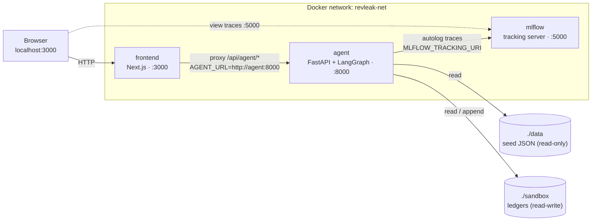
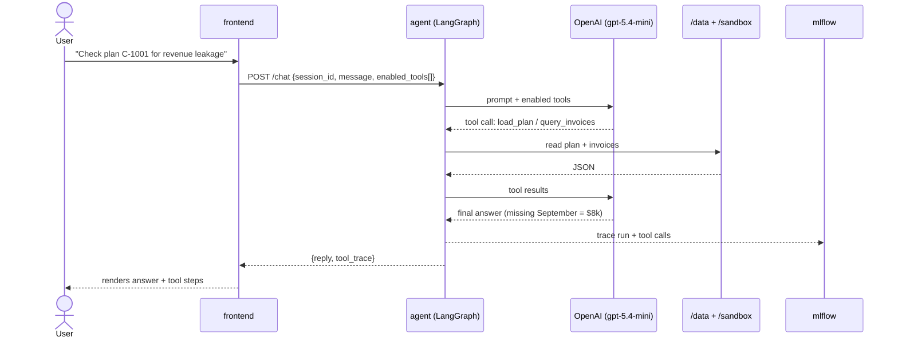
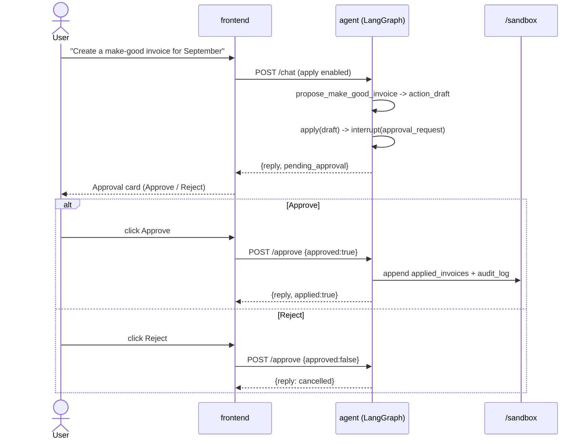
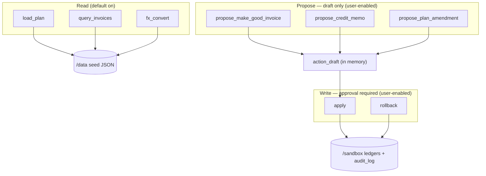

# Revenue Leakage Agent — Architecture

Visual guide to how the app is wired. Diagrams render on GitHub (Mermaid).

## 1. System overview

Three containers on one Docker network, two shared volumes.



| Service  | Host:Container | Role                                   |
|----------|----------------|----------------------------------------|
| frontend | 3000:3000      | Chat UI + tool toggles + approval card |
| agent    | 8000:8000      | Agent API + the 8 tools                |
| mlflow   | 5000:5000      | Tracing UI / tracking store            |

## 2. Chat turn (investigation)

The agent keeps memory per session via `thread_id = session_id`.



## 3. Propose → Apply (human-in-the-loop)

Write tools pause the graph with `interrupt()`; nothing is written until the user approves.



## 4. Tools and data



## 5. Endpoint contract

| Method | Path                | Body / Notes                                                  |
|--------|---------------------|--------------------------------------------------------------|
| POST   | `/chat`             | `{session_id, message, enabled_tools[]}` → `{reply, tool_trace[], pending_approval?}` |
| POST   | `/approve`          | `{session_id, approved}` → resumes the interrupted run        |
| GET    | `/tools`            | tool catalog + default enablement                            |
| GET    | `/sandbox/{ledger}` | `applied_invoices` \| `applied_credit_memos` \| `plan_amendments` \| `audit_log` |
| GET    | `/health`           | liveness                                                     |

## 6. Run

```bash
cp .env.example .env   # set OPENAI_API_KEY
docker compose up --build
# frontend  http://localhost:3000
# agent     http://localhost:8000/health
# mlflow    http://localhost:5000
```
